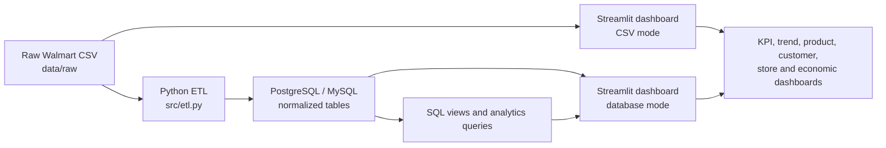
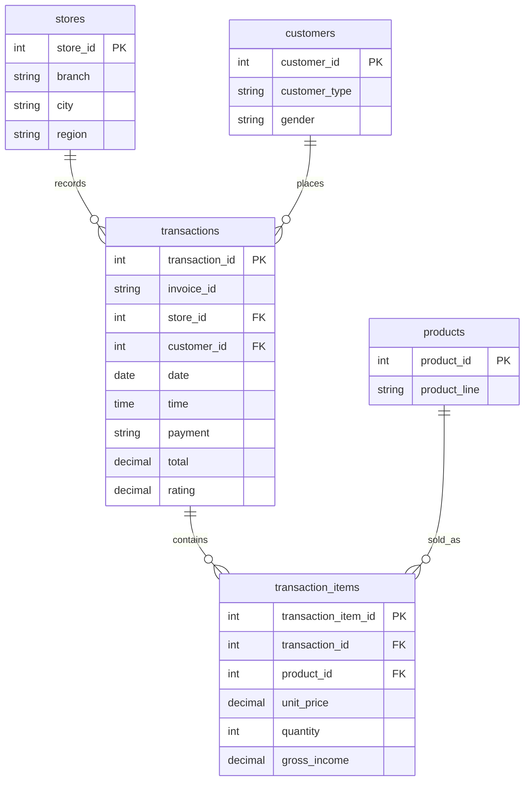
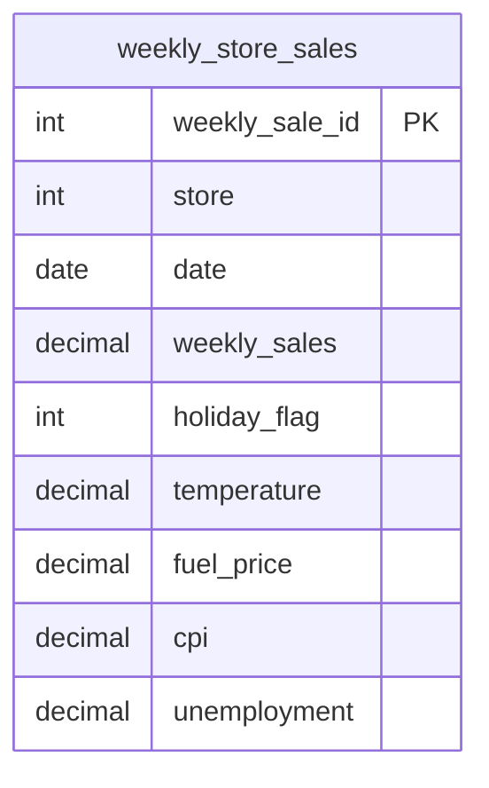

# Architecture and ER Diagrams

## Project Architecture

```mermaid
flowchart LR
    A["Raw Walmart CSV<br/>data/raw"] --> B["Python ETL<br/>src/etl.py"]
    B --> C["PostgreSQL / MySQL<br/>normalized tables"]
    C --> D["SQL views and analytics queries"]
    A --> E["Streamlit dashboard<br/>CSV mode"]
    C --> F["Streamlit dashboard<br/>database mode"]
    D --> F
    E --> G["KPI, trend, product, customer,<br/>store and economic dashboards"]
    F --> G
```

## POS ER Diagram

```mermaid
erDiagram
    stores ||--o{ transactions : records
    customers ||--o{ transactions : places
    transactions ||--o{ transaction_items : contains
    products ||--o{ transaction_items : sold_as

    stores {
        int store_id PK
        string branch
        string city
        string region
    }

    customers {
        int customer_id PK
        string customer_type
        string gender
    }

    products {
        int product_id PK
        string product_line
    }

    transactions {
        int transaction_id PK
        string invoice_id
        int store_id FK
        int customer_id FK
        date date
        time time
        string payment
        decimal total
        decimal rating
    }

    transaction_items {
        int transaction_item_id PK
        int transaction_id FK
        int product_id FK
        decimal unit_price
        int quantity
        decimal gross_income
    }
```

## Real Weekly Dataset Table

```mermaid
erDiagram
    weekly_store_sales {
        int weekly_sale_id PK
        int store
        date date
        decimal weekly_sales
        int holiday_flag
        decimal temperature
        decimal fuel_price
        decimal cpi
        decimal unemployment
    }
```

